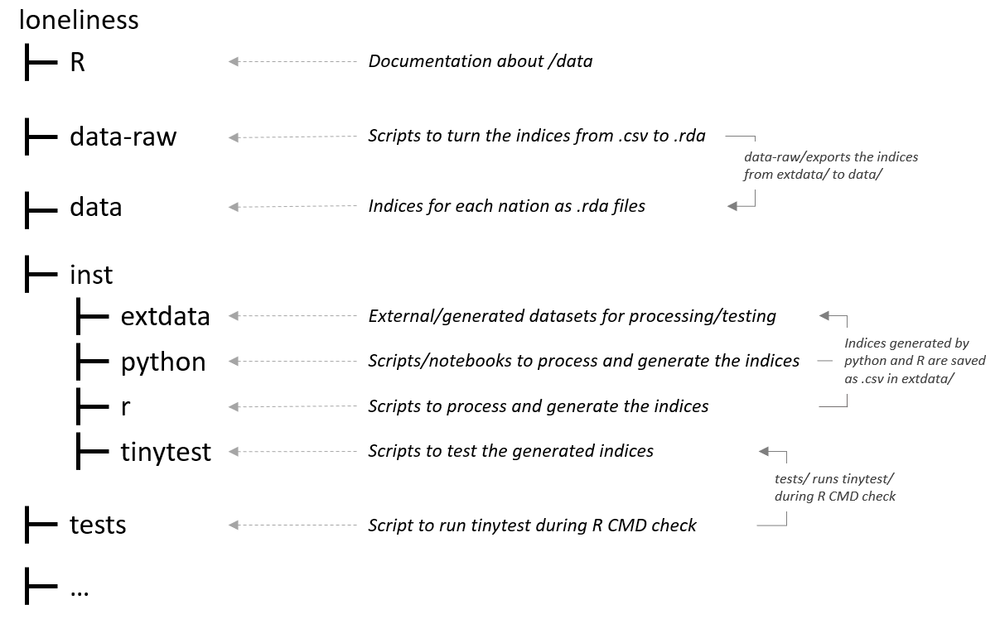

# loneliness </a>

<!-- badges: start -->
[](https://www.repostatus.org/#wip)
<!-- badges: end -->
**Under active development**

## Overview
loneliness is an R package for distributing Loneliness Indices for the UK. 

The Loneliness Index scores, ranks and deciles each LSOA in each nation of the UK from most lonely to least lonely. 

In England the score is based on the self-reported [Community Life Survey](https://www.gov.uk/government/statistical-data-sets/dcms-community-life-survey-ad-hoc-statistical-releases). 

In Scotland, Wales and Northern Ireland the score is based on GP prescriptions associated with loneliness related conditions. It is based on [an approach developed by the Office for National Statistics' Data Science Campus](https://datasciencecampus.ons.gov.uk/developing-a-loneliness-prescription-index/), which uses GP prescription data to find areas with above-average prescriptions for conditions where loneliness has been shown to be a risk factor: Alzheimer's, depression, hyperternsion, diabetes, cardiovascular disease, anxiety, addiction and insomnia. 

Scores are comparable within nations but not between nations. 

## Installation
You can install the development version from
[GitHub](https://github.com/) with:

``` r
# install.packages("devtools")
devtools::install_github("humaniverse/loneliness")
```
## Structure
While the data is distributed through an R package, the processing and modelling is done in a combination of Python and R.



## Development
### Virtual Environments
This project uses `requirements.txt` to manage Python package dependencies. 

To create and activate the virtual environment using Python's inbuilt `venv` module:
* Create a new virtual environment:
  - `python -m venv venv_loneliness`
* Activate the virtual environment:
  - Windows: `venv_loneliness\Scripts\activate.bat`
  - Unix: `source venv_loneliness/bin/activate`
* Install the packages:
  - Windows: `pip install -r requirements-win.txt`
  - Unix: `pip install -r requirements-unix.txt`
* Deactivate the virtual environment:
  - `deactivate`

### Testing
`tinytests` is used for testing the datasets and `devtools::check()` for package testing. To run tests:
* Load the package `pkgload::load_all(".")`
* Run `tinytests::test_all()` to check for errors in the datasets
* Run `devtools::check()` to check for errors/warnings/notes.

## Drug List
  Sources for the treatment drugs below:
  * [Depression - NICE](https://bnf.nice.org.uk/treatment-summaries/antidepressant-drugs/); [Depression - NHS](https://www.nhs.uk/mental-health/talking-therapies-medicine-treatments/medicines-and-psychiatry/antidepressants/overview/)
  * [Alzheimer](https://www.nice.org.uk/guidance/ta217)
  * [Hypertension - NICE](https://bnf.nice.org.uk/treatment-summaries/hypertension/#related-drugs); [Hypertension - NHS](https://www.nhs.uk/conditions/high-blood-pressure-hypertension/treatment/#:~:text=Common%20examples%20are%20amlodipine%2C%20felodipine,and%20verapamil%2C%20are%20also%20available.)
  * [Type 2 Diabetes](https://bnf.nice.org.uk/treatment-summaries/type-2-diabetes/)
  * [Cardiovascular disease](https://www.nhs.uk/conditions/coronary-heart-disease/treatment/)
  * [Insomnia](https://cks.nice.org.uk/topics/insomnia/)
  * [Addiction](https://cks.nice.org.uk/topics/opioid-dependence/)
  * [Social anxiety](https://cks.nice.org.uk/topics/generalized-anxiety-disorder/prescribing-information/escitalopram-paroxetine-sertraline/)

## Credits
See [LICENSE](/LICENSE)
